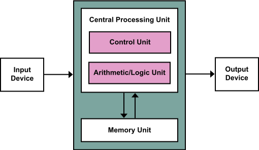
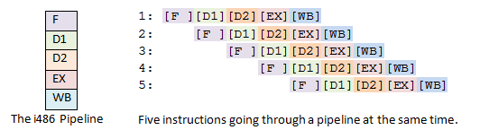
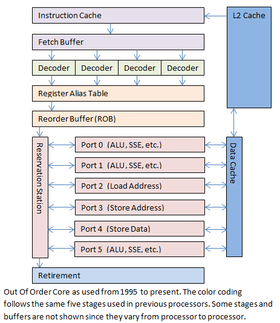
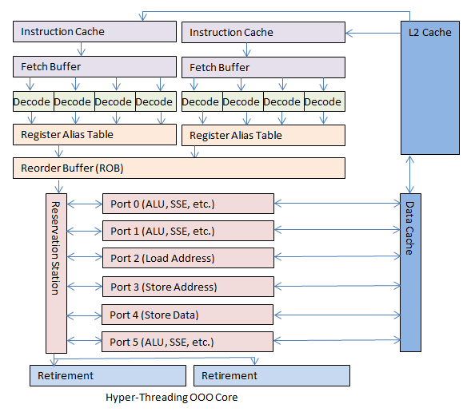

% Cpu code optimizations
% Jiří Novotný & Karel Kubíček
% 23. October 2015
----

# Why to write optimized code

. . .

*We don't want our code to procrastinate!*

----

# Use best algorithm for you use case

~~~~~~~c++
bool isPrime(int p) {
  for (int i = 2; i < p; i++)
    if (p % i == 0) return false;
  return true;
}
~~~~~~~

. . .

~~~~~~~c++
bool isPrimeBetter(int p) {
  for (int i = 2; i < sqrt(p); i++)
      if (p % i == 0) return false;
  return true;
}
~~~~~~~

. . .

~~~~~~~c++
bool isPrimeEvenBetter(int p) {
  for (int i = 2; i*i < p; i++) //or store sqrt once
    if (p % i == 0) return false;
  return true;
}
~~~~~~~

----

# CPU -- you know it as a blackbox

\ 

----

# CPU

## Little of history :)

* Direct load of instruction from memory
    * Solution: cache
* Load, decode, translate needed memory address, execute, retire
    * Pipeline
\ 

----

## CPU -- Little of history :)

* Will this work?

~~~~~~~c++
void swap(int &a, int &b) {
  int tmp = a;
  a = b;
  b = tmp;
}
~~~~~~~

\ 

----

## CPU -- Little of history :)

* Pipeline stall (bubble)
    * Out-of-order execution
\ 

----

## CPU -- Little of history :)

* OOO needs to load a lot of instructions (128), what to do with conditional jumps?
   * Branch prediction
       * [Branch misprediction on bublesort](http://nicknash.me/2012/10/12/knuths-wisdom/)
* OK, finally, our CPU is really fast, so fast, that memory is slow and does not provide input data
    * Simultaneous multithreading (HT)

----

### Simultaneous multithreading (HT)

\ 

----

# CPU -- Modern instructions  (x86 is not strict RISC)

> * SIMD
    * SSE, SSE2-4.2 (128b)
    * AVX, AVX2 (~ FMA in AMD's world) (256b)
    * AVX-512 (512b)
* interesting (but not SIMD) new instructions:
    * [TSX](https://software.intel.com/en-us/blogs/2012/02/07/transactional-synchronization-in-haswell) -- Transactional Synchronization Extensions
    * [SGX](https://software.intel.com/en-us/blogs/2013/09/26/protecting-application-secrets-with-intel-sgx) (in development) -- Software Guard Extensions

----

# The C/C++ programmer view

> * know your compiler, programming language and target architecture
> * don't try to be smarter then your compiler -- compilers are pretty smart :P
> * different levels of compiler optimizations `-O0 -O1 -O2 -O3`

----

## Vectorization

* today compilers can vectorize you code automaticaly

~~~~~~~c++
        for (int i = 0; i < 32; i++)
            c[i] = a[i] + b[i];
~~~~~~~

* ...but several constraints must be met to make it fast
    * memory alignemnt to 16 bytes (later)
    * process data in order to make the full use of processor's cache

---

## Default allocator

> * `malloc`/`new`
> * for most cases they will do fine but when performance is needed they are slow

. . .

## Custom allocators
> * preallocate the memory by the default allocator
  * within the preallocated block you can implement you own allocator when you know something about your data
  * different types for different purpouse
    * stack allocator (elements of variable size; stack ordering)
    * pool allocator (elements of fixed size; custom ordering)

----

## Chaching

> * cacheline -- 64 bytes long
> * try to fit related  variables into one cacheline
> * c++11 keyword `alignas`

~~~~~~~c++
        alignas(64) char cacheline[64];
        alignas(16) float vec4[4];
~~~~~~~

----

# Profiling

## Tools
> * `perf` (linux)
> * `Microsoft Visual Studio` (windows)

. . .

## Two possible techniques
> * sampling vs. instrumentation

----

# Paralelization

## C++11 high level approach (using `std::async`)
~~~~~~~c++
#include <future>
std::future<int> result = std::async(&work, args...);
// some work in this thread
result.get() // fetch the result
~~~~~~~

## C++11 low level approach (using `std::thread`)
~~~~~~~c++
#include <thread>
std::thread t(&work, args...); // launch other thread
// some work
t.join() // wait till the other thread finisches
// ...but we can't use std::future to fetch the result
~~~~~~~

----

## Useful hints

1. write functonal correct code
2. analyze the code and determine parts that are slow and critical
3. optimize them
4. GOTO 2. till satisfied

. . .

## Great tools
> * [Online C/C++ to assembly (using many compilers)](https://gcc.godbolt.org/)
> * [Intel intrinsics reference](https://software.intel.com/sites/landingpage/IntrinsicsGuide)

----

# Try it yourself!

> * Go to crcs.cz -> OpenLab -> CPU optimizations -> [task.zip](http://crcs.cz/wiki/lib/exe/fetch.php?media=public:crocs:openlab-cpu-optimization-task.zip)

## Sources
> * Intro images & idea: [A Journey Through the CPU Pipeline ](http://www.gamedev.net/page/resources/_/technical/general-programming/a-journey-through-the-cpu-pipeline-r3115)
 * (Almost) current architecture: [Haswell is here. Architecture](http://www.cnews.cz/clanky/haswell-je-zde-inovace-architektura-nove-generace-procesoru-intel)
 * [Basic C++ optimizations](http://www.eventhelix.com/RealtimeMantra/Basics/OptimizingCAndCPPCode.htm)

